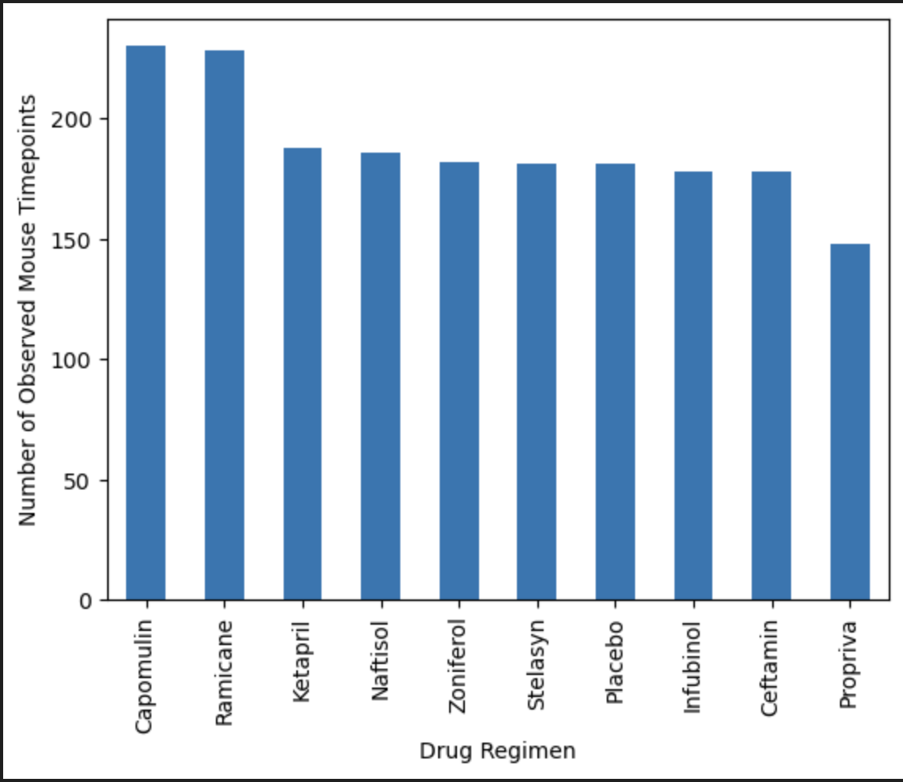
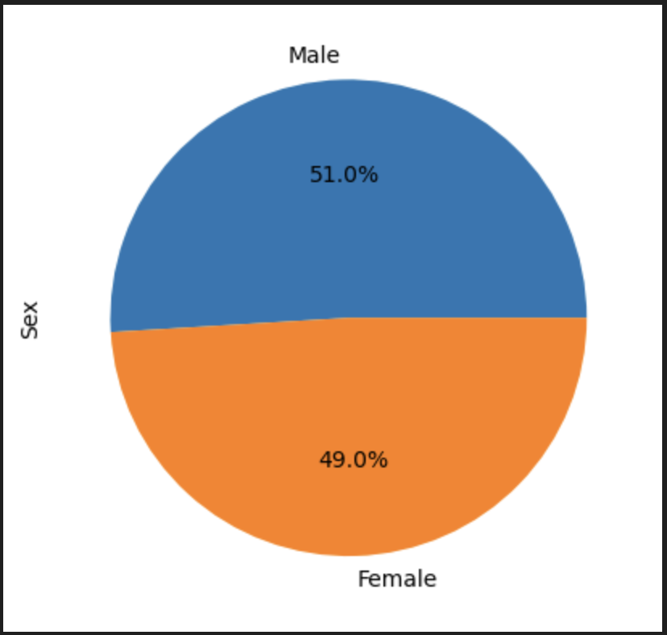
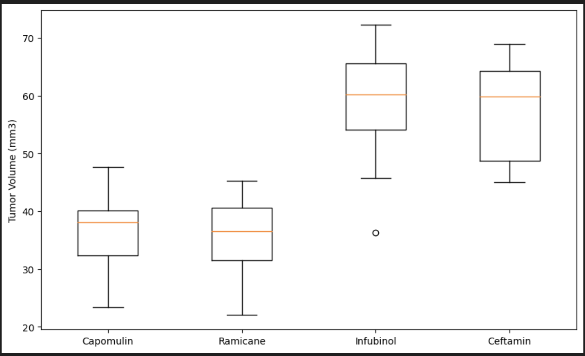
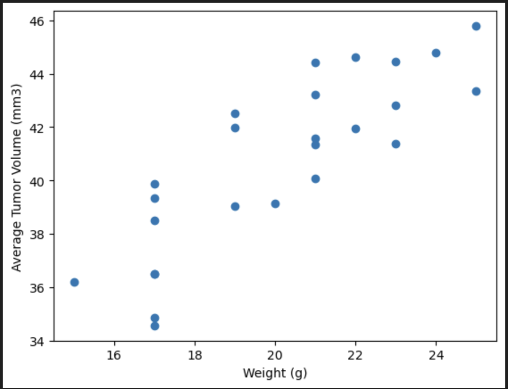
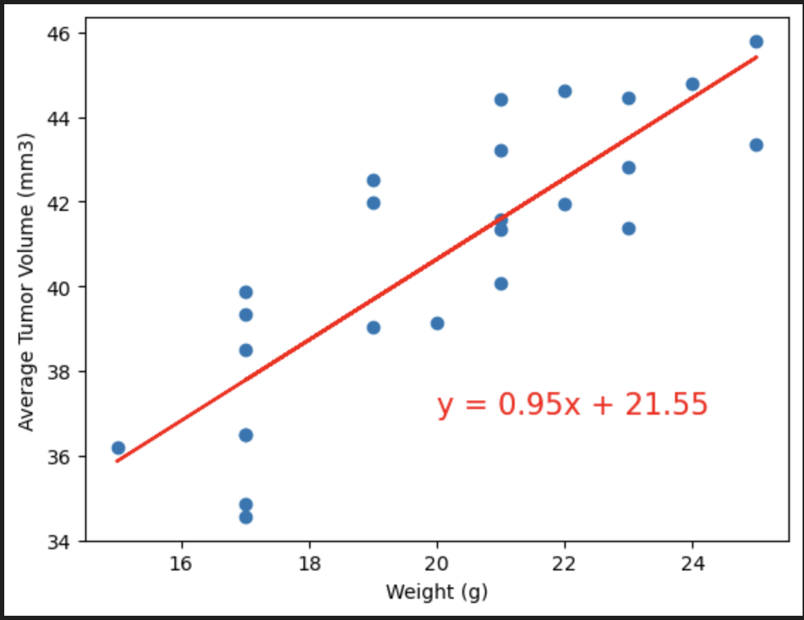

# Pymaceuticals---challenge
This repository contains all the files related to the Pymaceuticals Challenge

## Solution
There is one folder called pymaceuticals_starter.ipynb in which you will find the file with the code and the Data folder contains the resource files needed for the challenge.

## Analysis
- From the bar chart, we can see that Capomulin regimen is used more compared to other drug regimens. 
- From the box plot, we can come to the analysis that Camomulin is the most effective medicine at reducing tumor volume followed by Ramicane based on the data we have. We concuded that becauase Campomulin has the lowest median tumor volume and the smallest interquartile range which suggests that Capomulin is more steady in its effect on tumor volume. 
- From the scatter plot, we see that there is a correlation between the weight of the mice and its affect on tumor size. The less the mice weighs, it helps decrease tumor size. The correlation between the average tumor volume and weight for Capomulin regimen is 0.84 which indicates a linear correlation.

## Help Taken
Help was taken from BCS Learning on bar chart, and some part of Quartile, Outlier, Boxplot section. 

## Screenshots
I have uploaded the screenshots for the output for bar plot, pie chart, box plot, scatter plot, line plot and correalation and regression plot.

Bar plot showing the total number of rows (Mouse ID/Timepoints) for each drug regimen

Pie plot showing the distribution of female versus male mice

Box plot that shows the distrubution of the tumor volume for each treatment group

Line plot of tumor volume vs. time point for a single mouse treated with Capomulin

Scatter plot of mouse weight vs. the average observed tumor volume for the entire Capomulin regimen

Correlation and Regression Plot

